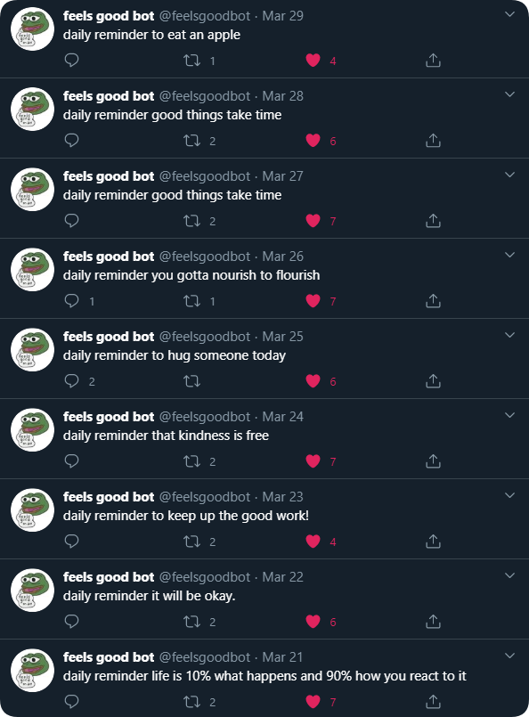

# feelsgoodbot :)
Twitter bot (@feelsgoodbot) that automatically tweets something sweet daily at 9:00am EST.  

  
## Setup
**tokens.txt** is where you add your environment variables. In your Gemfile, make sure you have **gem 'twitter'**, **gem 'mongo'** and be sure to run the command **gem bundle install**.  
  
## Follow me!
Bot is currently up and running at twitter.com/feelsgoodbot :)
